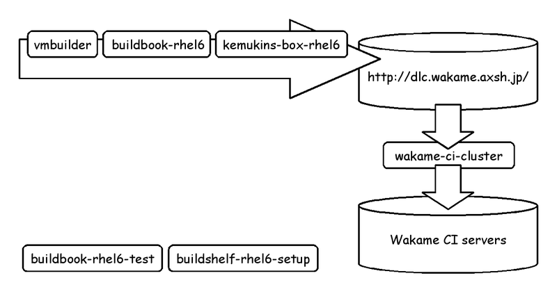

Big Picture
===========

The big picture on axsh projects.

## Products

### Wakame-vdc

xxx TODO: Draw picture to explain relation on the modules.

* [wakame-vdc](https://github.com/axsh/wakame-vdc) - IaaS (Infrastructure as a Service) cloud computing framework.
* [wakame-dolphin](https://github.com/axsh/wakame-dolphin) - A notification service.
* [isono](https://github.com/axsh/isono) - A messaging and agent fabric.
* [fuguta](https://github.com/axsh/fuguta) - Configuration framework for Ruby programs.

### OpenVNet

xxx TODO: Draw picture to explain relation on the modules.

* [openvnet](https://github.com/axsh/openvnet) - Data Center Level Virtual Network Toolkit.
* [trema](https://github.com/axsh/trema) - An Open Source modular framework for developing OpenFlow controllers in Ruby/C. (axsh patched)
* [sinatra-browse](https://github.com/axsh/sinatra-browse) - Parameter declaration framework and browsable API for Sinatra.
* [openvnet-testspec](https://github.com/axsh/openvnet-testspec) - OpenVNet Integration Test Specifications.
* [vnet-from-scratch](https://github.com/axsh/vnet-from-scratch) - Run OpenVNet system on LiveCD image and KVM.

### Middleware

xxx TODO

## Continuous Integration (CI)

* [vmbuilder](https://github.com/hansode/vmbuilder) - builds virtual machines from the command line.
* [buildbook-rhel6](https://github.com/hansode/buildbook-rhel6) - Buildbook for RHEL6.
* [kemukins-box-rhel6](https://github.com/wakameci/kemukins-box-rhel6) - Kemukins build environment provides rpmbuild and vmimage file build.
* [buildbook-rhel6-test](https://github.com/hansode/buildbook-rhel6-test) - Test Buildbook for RHEL6.
* [buildshelf-rhel6-setup](https://github.com/hansode/buildshelf-rhel6-setup) - buildbook-rhel6 based building framework setup script.

## Testing

xxx TODO
